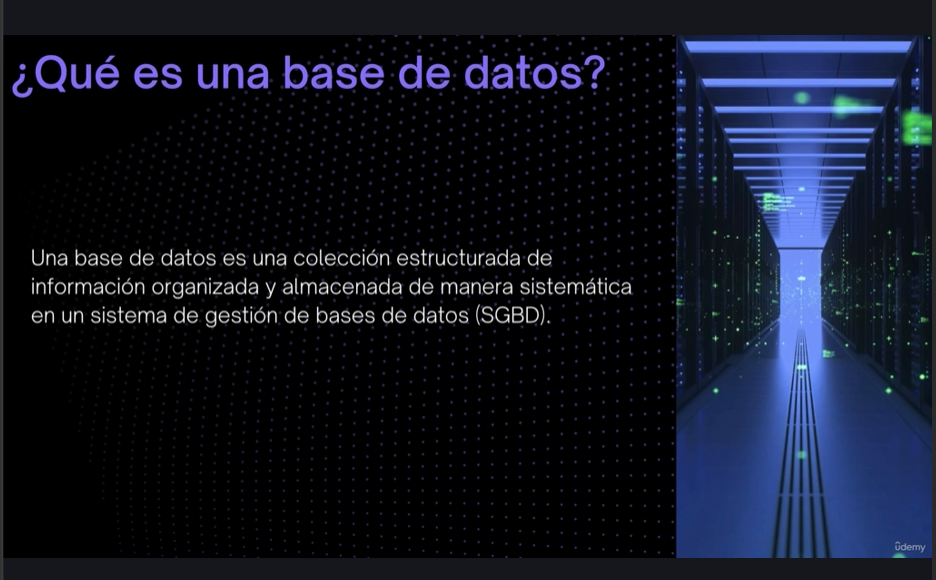
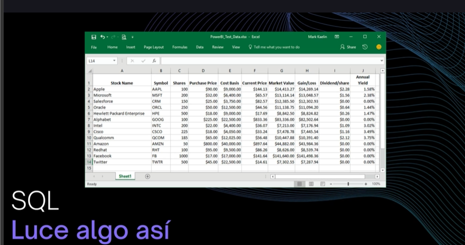
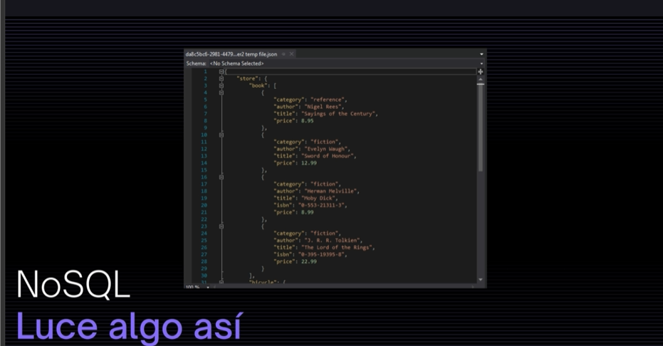
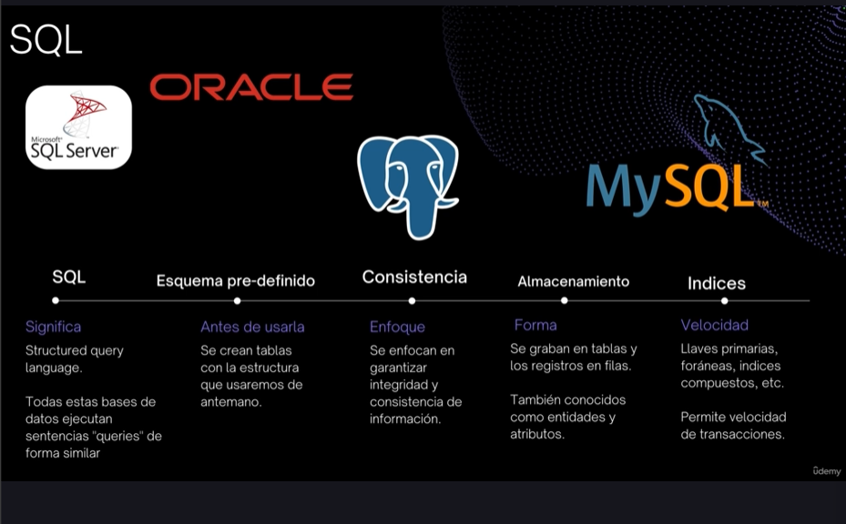
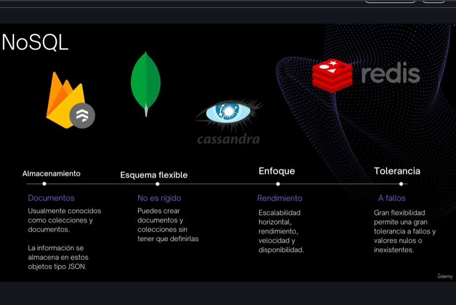

## Que son bases de datos?

Una base de datos es una coleccion de estructurada de informacion organizada y almacenada de manera sistematica en sistema de gestion de bases de datos (SGBD).

## Tipos de bases de datos

- SQL: Las bases de datos relacionales (SQL) organizan la informacion en tablas relacionadas entre si mediante claves primarias y foraneas, y permiten consultar y manipular datos usando el lenguaje SQL (Structured Query Language).

Similar a una hoja de excel, columnas y filas.

- NOSql: Las bases de datos no relacionales , almacenan informacion en objetos que se llaman usualmente como documentos y tambien hay colecciones quienes agrupan los documentos.

Generalmente lucen asi , objetos json

