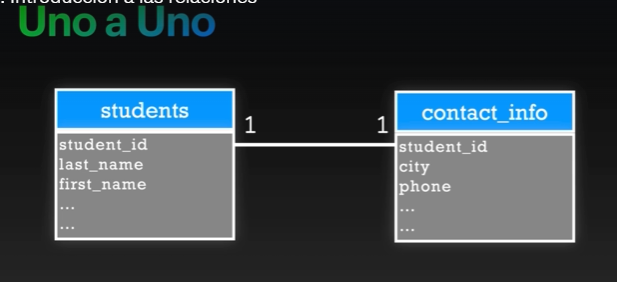
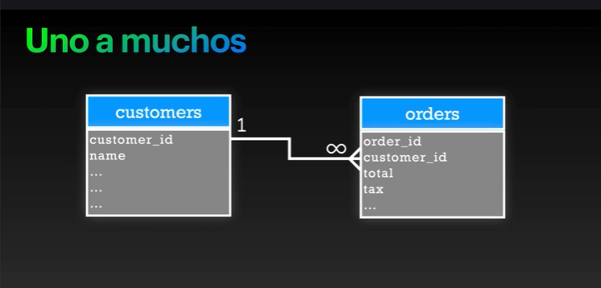
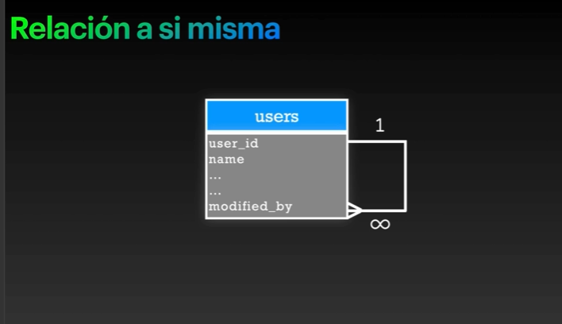
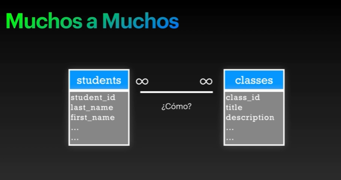
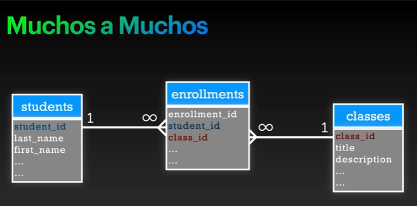
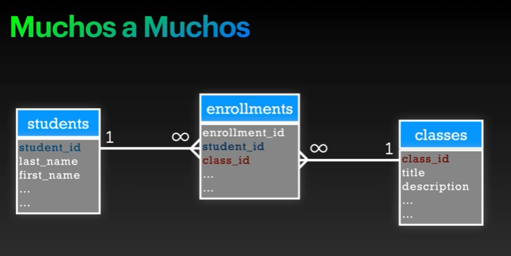
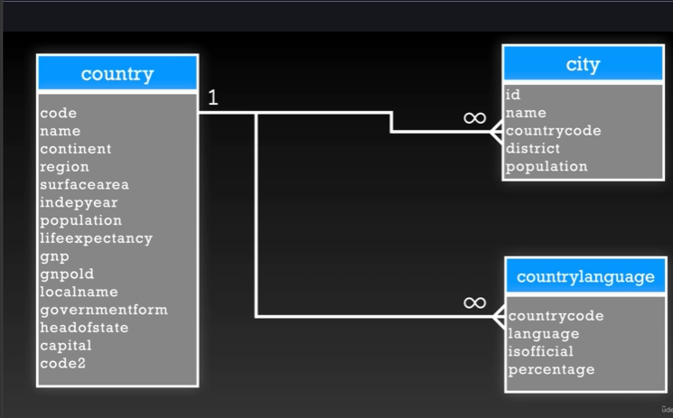

# Tipos de relaciones

- Relaciones de uno a uno  - One to One
- Uno a muchos - One to many
- Relaciones a si mismas - self Joining relationships
- Muchos a Muchos - Many to Many

## Relacion uno a uno



## Uno a muchos



- un cliente puede tener muchas ordenes y una orden puede pertenecer a un solo cliente.

## Relacion a si misma



### Relación a sí misma (Self Relationship)

Una relación a sí misma ocurre cuando una tabla se relaciona con ella misma.

Esto significa que un registro puede apuntar a otro registro dentro de la misma tabla.

La cardinalidad de esa imagen se leería así:

Un usuario puede modificar muchos usuarios.

Cada usuario puede ser modificado por un solo usuario.

### Ejemplo con usuarios

Tabla:

| user_id | name  | modified_by |
|----------|-------|-------------|
| 1        | Alex  | NULL        |
| 2        | Juan  | 1           |
| 3        | María | 1           |

---

### ¿Qué significa `modified_by`?

La columna:

```sql
modified_by
```

## Muchos a Muchos



Muchos estudiantes pueden estar en muchas classe y muchas clases pueden tener muchos alumnos.

`Como podriamos hacer ese tipo de relacion?`

- La clave consta en que nosotros creemos una tabla intermedia en la cual en este caso le vamos poner enrollments y un id de enrollments que en teoria puede ser opcional ya que podemos poner llaves compuestas entre
Student id y la clase ID y eso deberia ser unico. Pero en general tambien se aconseja de que todo tenga una llave indentifcada facilmente , como es decir una llave primaria.



Entonces una relacion de unos a muchos no es mas que una relacion nuevamente , de uno a muchos y de muchos a uno.



Por eso dicen algunas personas que las relaciones de muchos a muchos no existen.

Traducción completa de toda la relación
Un estudiante puede estar inscrito en muchas clases.
Una clase puede tener muchos estudiantes.


ejemplo: 