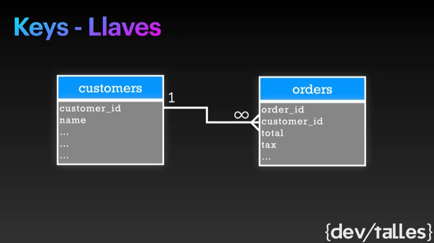
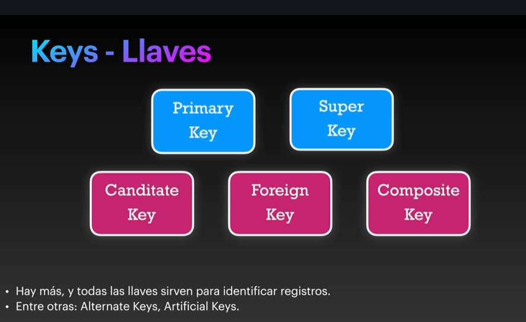
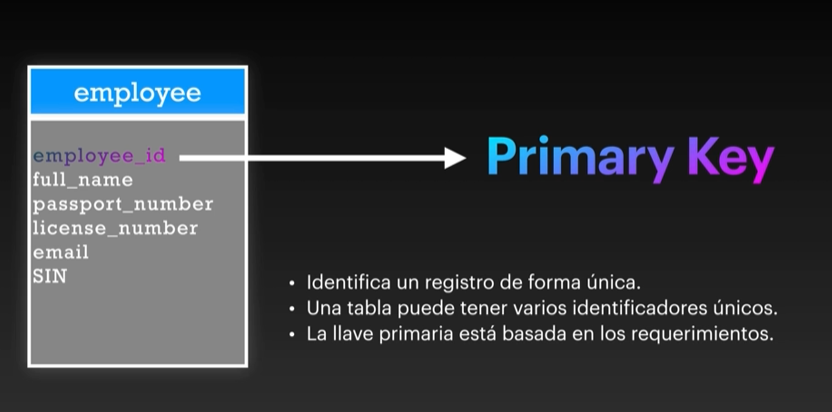
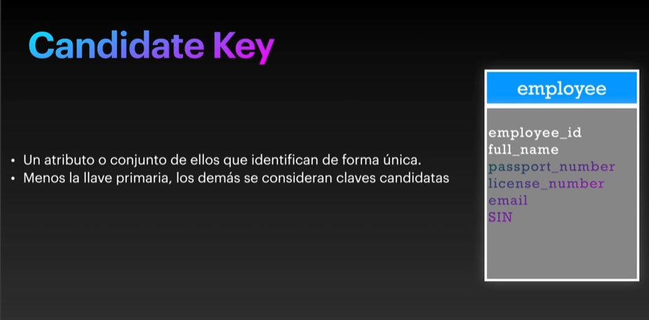
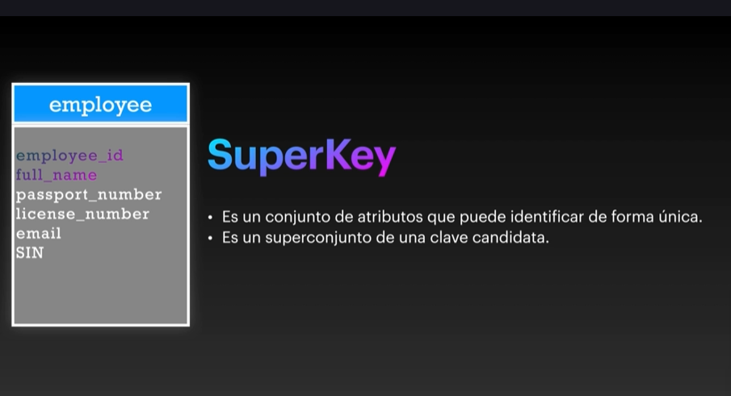
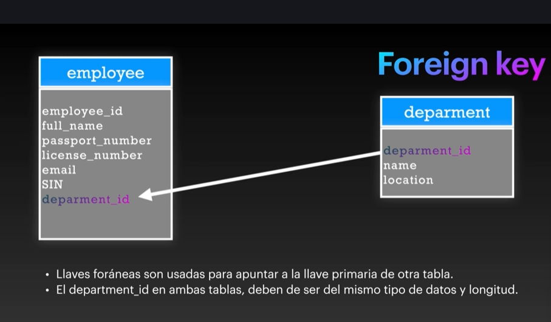
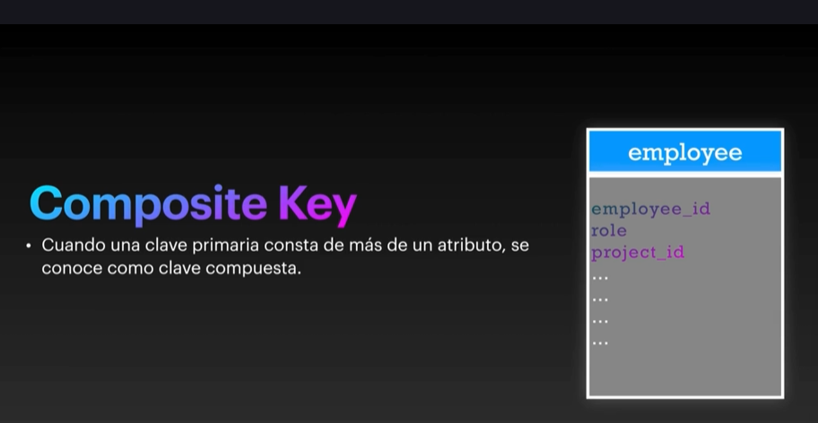

# Keys - Llaves

Para que las relaciones de base de datos sean posibles se necesitann llaves.

Aunque si es posible trabajar con queries y hacer las relaciones entre ella, pero esto no es recomendado y si se hace de esta manera , perderiamos mucho poder de la base de datos, muchos constrains y funciones y eso quita la integridad referencial  y entiendase las palabras integridad referencial a asegurarse que la data esta congruente entre si.

## Tipos de llaves

Las llaves son constrains y estos son restricciones.

### Primary key

- Identifican un registro de forma unica.
- Una tabla puede tener varios identificadores unicos.
- La llave primaria esta basada en los requerimientos.

- No depender de llaves de tercero , siempre tener un id dependiente controlado por nosotros.

## Candidate key 

- Un atributo o conjunto de ellos que identifican de forma unica.
- Menos la llave primaria, los demas se concideran claves candidatas por ejemplo el passort_number sabemos que es unico y tambien el lincence_number.

En conclusion las claves candidatas no es mas que ese conjunto de atributoss que identifican de forma unica ese registro.

## SuperKey

- Es un conjunto de atributos que puede idenficar de forma unica.
- Es un conjunto de una clave candidata.

Basicamente lo que tenemos aqui es nuestro employee_id y si hacemos la llave super key del employee_id + el full name esto podria ser un super_key identificador unico , sabes que el nombre de persona puede ser duplicado pero si lo unimos a employe_id va ser unico.

## Foreign key

- Llaves foraneas son usadas para apuntar a la llave primaria de otra tabla.
- El department_id en ambas tablas , deben der ser el mismo tipo de dato y longitud.

## Composite Key

- Cuando una clave primaria consta de mas de un atributo , se conoce como clave compuesta.